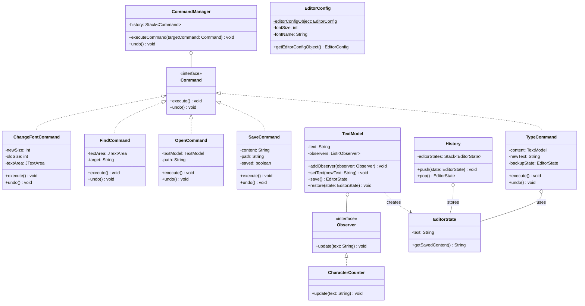

# Text Editor Project

Bu proje, Java Swing kullanılarak geliştirilmiş ve çeşitli **Tasarım Desenleri (Design Patterns)** ile güçlendirilmiş gelişmiş bir metin editörüdür.

## Özellikler

* **Metin Düzenleme:** Temel metin giriş ve düzenleme işlemleri.
* **Geri Al (Undo):** Yapılan yazma, font değiştirme ve dosya açma gibi işlemlerin geri alınabilmesi.
* **Font Yönetimi:** Yazı tipi boyutunun dinamik olarak artırılıp azaltılması.
* **Dosya İşlemleri:** Dosya açma (`Open`), üzerine kaydetme (`Save`) ve farklı kaydetme (`Save As`) desteği.
* **Arama:** Metin içinde kelime arama ve vurgulama.
* **Satır Sayma:** `Iterator` deseni ile metindeki satır sayısının hesaplanması.
* **Karakter Sayacı:** `Observer` deseni ile gerçek zamanlı karakter takibi.

## Mimari ve Tasarım Desenleri

Proje, yazılımın genişletilebilir ve bakımı kolay olması için aşağıdaki desenleri kullanır:

1.  **Command (Komut) Deseni:** Tüm kullanıcı eylemleri (`TypeCommand`, `SaveCommand`, `OpenCommand`, `ChangeFontCommand`, `FindCommand`) birer komut nesnesi olarak kapsüllenmiştir. `CommandManager` bu komutların yürütülmesini ve `Undo` geçmişini yönetir.
2.  **Observer (Gözlemci) Deseni:** `TextModel` sınıfı bir "Subject" görevi görür. Metin değiştiğinde kayıtlı tüm gözlemciler (örneğin `CharacterCounter`) otomatik olarak güncellenir.
3.  **Singleton (Tekil) Deseni:** `EditorConfig` sınıfı, uygulamanın genel ayarlarını (font, tema vb.) tek bir noktadan yönetmek için kullanılır.
4.  **Memento / State Deseni:** `EditorState` ve `History` sınıfları, metnin önceki durumlarını saklayarak geri alma işlemini mümkün kılar.
5.  **Iterator (Yineleyici) Deseni:** `LineIterator`, metindeki satırlar üzerinde esnek bir şekilde gezinmeyi sağlar.

## UML Sınıf Diyagramı

Aşağıdaki Mermaid diyagramı projenin sınıf yapısını ve ilişkilerini göstermektedir. Bu kod bloğunu GitHub `README.md` dosyanıza eklediğinizde otomatik olarak görselleşecektir:

